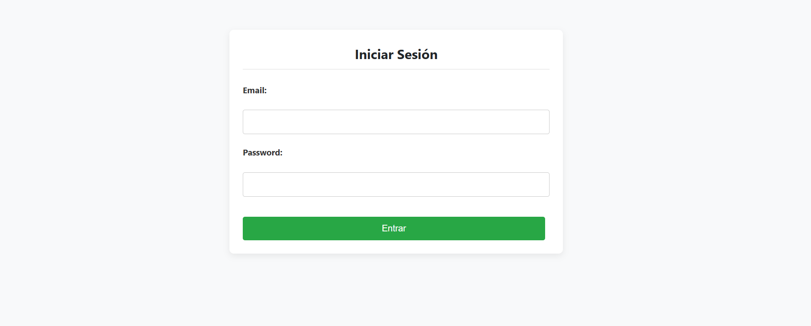
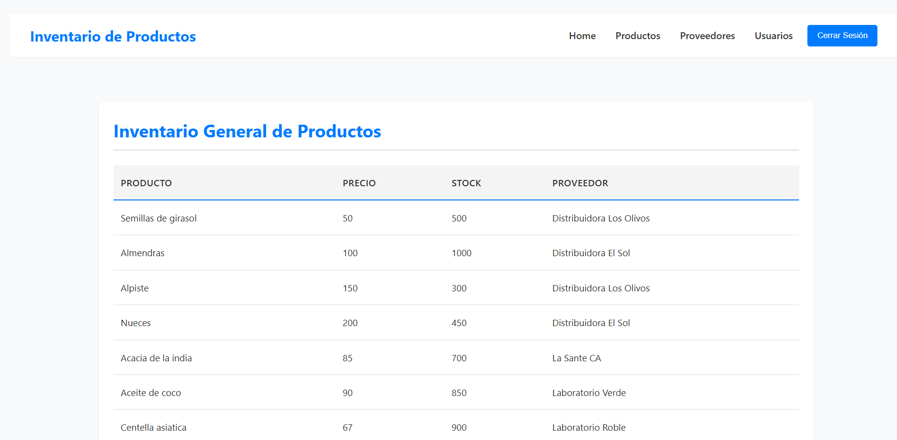
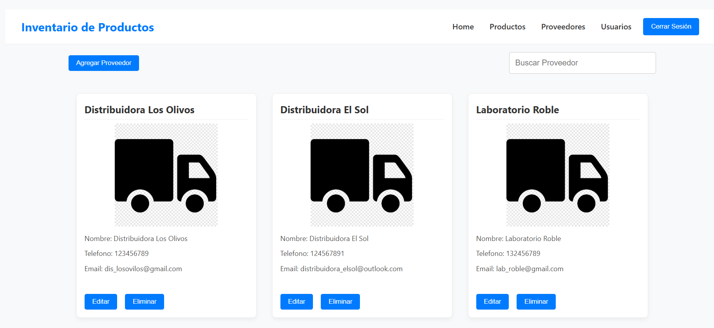
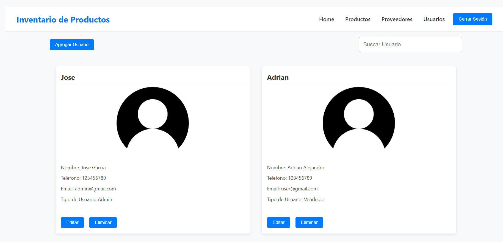

# 📦 Sistema de Gestión de Inventario (Full-Stack CRUD)

Este proyecto es un sistema de gestión de inventario **Full-Stack** diseñado para demostrar la implementación de una **arquitectura moderna** que incluye autenticación robusta basada en tokens (JWT) y manejo de autorización por roles tanto en el *frontend* como en el *backend*.

---

## 🚀 Stack Tecnológico Principal

| Componente | Tecnología | Rol Principal |
| :--- | :--- | :--- |
| **Frontend** | **React** | Interfaz de Usuario, Rutas Protegidas y Gestión de Estado (Context API). |
| **Backend (API)** | **Express.js** | Creación de la **API RESTful** para las operaciones CRUD. |
| **Base de Datos** | **MySQL** | Almacenamiento persistente de datos de productos y usuarios. |
| **Seguridad** | **JWT y bcrypt** | Autenticación basada en token y cifrado de contraseñas. |

---

## 💡 Características Implementadas

### 1. Arquitectura de Seguridad (Backend) 🛡️

* **Autenticación JWT Completa:** Se genera un token JSON Web Token tras el *login* para validar y autenticar todas las peticiones a la API.
* **Autorización por Rol:** Se implementa una **validación en el controlador** de Express.js para inspeccionar el rol del usuario (Administrador/Empleado) dentro del token, **restringiendo el acceso** a funcionalidades sensibles (CRUD).
* **Cifrado de Contraseñas:** Las contraseñas se almacenan en la base de datos de forma segura mediante **cifrado asíncrono con `bcrypt`**.

### 2. Gestión de Frontend (React)

* **Gestión de Estado Centralizada:** Se utiliza **Context API** para manejar el estado global de la aplicación, principalmente el estado de autenticación del usuario.
* **Rutas Protegidas:** La navegación se gestiona con **React Router**, implementando rutas protegidas que solo permiten el acceso a vistas específicas dependiendo del **rol** del usuario.

---

## 🔑 Credenciales de Prueba

Para probar las funcionalidades con diferentes niveles de acceso:

| Rol | Correo Electrónico | Contraseña | Vistas Accesibles |
| :--- | :--- | :--- | :--- |
| **Administrador (Admin)** | `admin@gmail.com` | `12345` | Todas (CRUD completo y Gestión de Usuarios). |
| **Empleado (Usuario)** | `usuario@gmail.com` | `12345` | Limitadas (solo Home y Productos). |

---

## Secciones Principales del Sistema

### Login



---

### Home 



---

### Productos 


---

### Proveedores (Solo Administradores)



---

### Usuarios (Solo Administradores)



---

## ⚙️ Cómo Ejecutar el Proyecto

1.  **Clonar el Repositorio:**
    ```bash
    git clone https://github.com/elmerrondon/sistema-inventario.git
    cd sistema-inventario
    ```
2.  **Configuración del proyecto:**
    ```bash
    cd sistema-inventario 
    npm install
    # Asegúrate crear la base de datos y ejecutar MySQL
    # Codigo para crear la base deatos en la carpeta config archivo db.sql 
    # Inicia el servidor:
    node app.js
    ```

El proyecto debería abrirse automáticamente en `http://localhost:3000`.