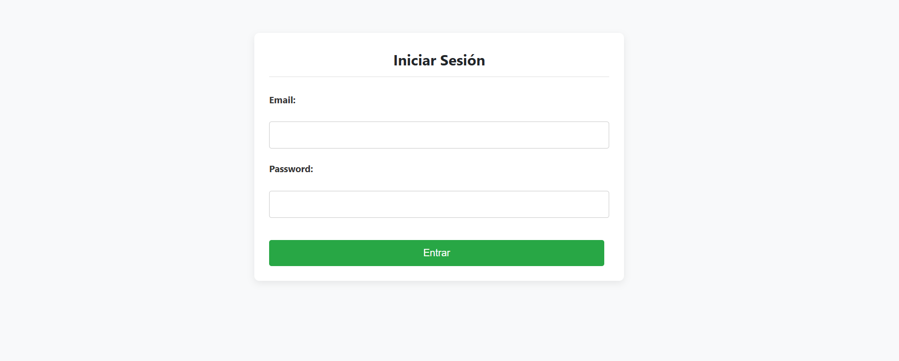
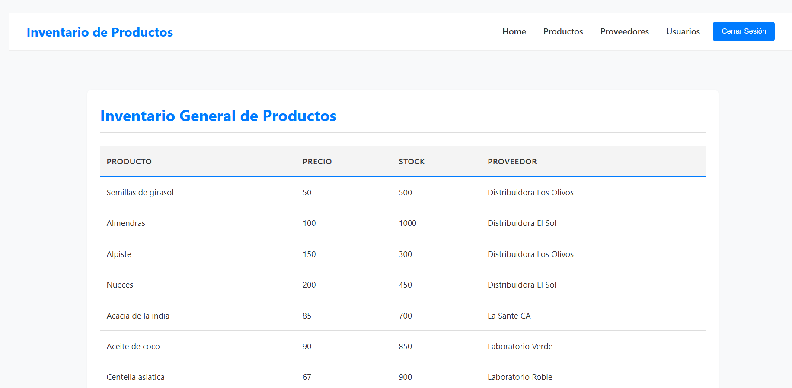
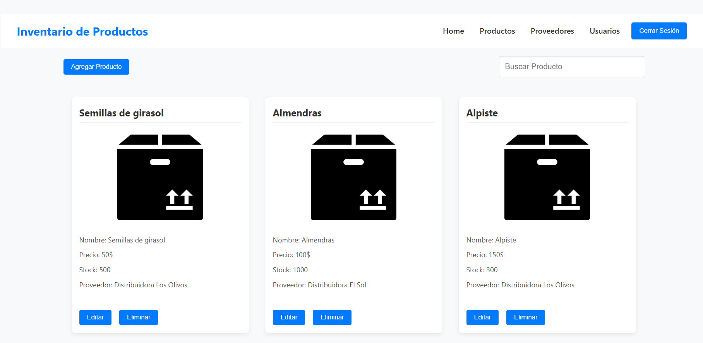
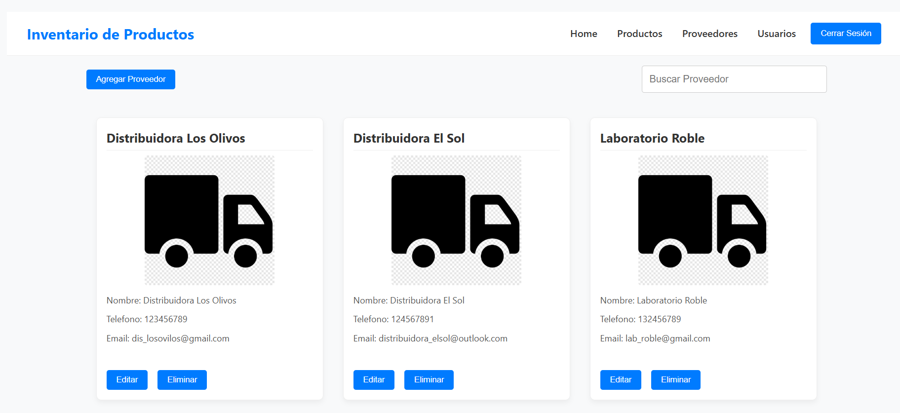
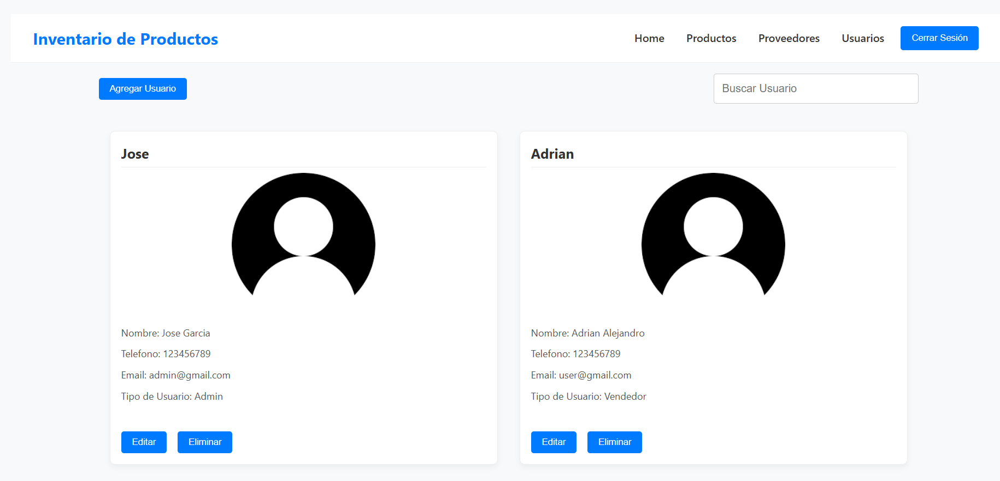

# 📦 Sistema de Gestión de Inventario (Full-Stack CRUD)

Este proyecto es un sistema de gestión de inventario **Full-Stack** diseñado para demostrar la implementación de una **arquitectura moderna** que incluye autenticación robusta basada en tokens (JWT) y manejo de autorización por roles tanto en el _frontend_ como en el _backend_.

---

## 🌐 ¡Prueba el proyecto en vivo!

👉 **<a href="https://sistema-inventario-bs96.onrender.com" target="_blank">ACCEDER AL DEMO ONLINE AQUÍ</a>** 👈

> **⚠️ Nota importante sobre el Demo:** El proyecto está alojado en la capa gratuita de Render. Si no ha recibido visitas en los últimos 15 minutos, el servidor entra en reposo. **La primera vez que ingreses, la página podría tardar entre 40 y 50 segundos en despertar y cargar.** ¡Gracias por tu paciencia!

---

## ☁️ Infraestructura y Despliegue

Este sistema ha sido diseñado para funcionar de manera óptima en entornos de producción en la nube. Actualmente está desplegado utilizando las siguientes plataformas:

- **Aplicación (Node.js/Express + React):** Alojada en **Render**. Funciona bajo una arquitectura monolítica donde el servidor de Express maneja la API REST y, al mismo tiempo, sirve los archivos estáticos del frontend de React ya compilado.
- **Base de Datos (MySQL):** Alojada en **Aiven**, utilizando una base de datos relacional gestionada de alta disponibilidad con conexión segura mediante SSL.

---

## 🚀 Stack Tecnológico Principal

| Componente        | Tecnología       | Rol Principal                                                            |
| :---------------- | :--------------- | :----------------------------------------------------------------------- |
| **Frontend**      | **React**        | Interfaz de Usuario, Rutas Protegidas y Gestión de Estado (Context API). |
| **Backend (API)** | **Express.js**   | Creación de la **API RESTful** para las operaciones CRUD.                |
| **Base de Datos** | **MySQL**        | Almacenamiento persistente de datos de productos y usuarios.             |
| **Seguridad**     | **JWT y bcrypt** | Autenticación basada en token y cifrado de contraseñas.                  |

---

## 💡 Características Implementadas

### 1. Arquitectura de Seguridad (Backend) 🛡️

- **Autenticación JWT Completa:** Se genera un JSON Web Token tras el _login_ para validar y autenticar todas las peticiones a la API.
- **Autorización por Rol:** Se implementa una **validación en el controlador** de Express.js para inspeccionar el rol del usuario (Administrador/Empleado) dentro del token, **restringiendo el acceso** a funcionalidades sensibles (CRUD).
- **Cifrado de Contraseñas:** Las contraseñas se almacenan en la base de datos de forma segura mediante **cifrado asíncrono con `bcrypt`**.

### 2. Gestión de Frontend (React)

- **Gestión de Estado Centralizada:** Se utiliza **Context API** para manejar el estado global de la aplicación, principalmente el estado de autenticación del usuario.
- **Rutas Protegidas:** La navegación se gestiona con **React Router**, implementando rutas protegidas que solo permiten el acceso a vistas específicas dependiendo del **rol** del usuario.

---

## 🔑 Credenciales de Prueba

Para probar las funcionalidades con diferentes niveles de acceso en el demo en vivo, puedes utilizar las siguientes credenciales:

| Rol                       | Correo Electrónico | Contraseña | Vistas Accesibles                                         |
| :------------------------ | :----------------- | :--------- | :-------------------------------------------------------- |
| **Administrador (Admin)** | `admin@admin.com`  | `12345`    | Todas (CRUD completo, Proveedores y Gestión de Usuarios). |
| **Empleado (Usuario)**    | `user@user.com`    | `12345`    | Limitadas (solo Home y Productos).                        |

---

## 📸 Secciones Principales del Sistema

### Login



### Home



### Productos



### Proveedores (Solo Administradores)



### Usuarios (Solo Administradores)



---

## ⚙️ Configuración y Ejecución Local

### Variables de Entorno

Para ejecutar este proyecto en tu máquina local, debes crear un archivo `.env` en la raíz del proyecto y definir las siguientes variables para la conexión a tu base de datos y la generación de tokens:

```env
SECRET_KEY="tu_cadena_secreta_super_segura"
PORT=3000
MYSQL_HOST="localhost"
MYSQL_USER="root"
MYSQL_PASSWORD="tu_password"
MYSQL_PORT=3306
MYSQL_DATABASE="sistema_productos"
```

### Instrucciones de Instalación

1. **Clonar el Repositorio:**

```bash
git clone [https://github.com/elmerrondon/sistema-inventario.git](https://github.com/elmerrondon/sistema-inventario.git)
cd sistema-inventario
```

2. **Instalar Dependencias:**

```bash
npm install
```

3. **Configurar la Base de Datos Local:**

- Asegúrate de tener MySQL ejecutándose en tu máquina.
- Importa y ejecuta el script SQL ubicado en la ruta `config/db.sql` (o donde lo hayas guardado) para crear las tablas necesarias e insertar la data de prueba inicial.

4. **Iniciar el Servidor:**

```bash
node app.js
```

El servidor backend se iniciará y el proyecto estará disponible en tu navegador apuntando a `http://localhost:3000`.
